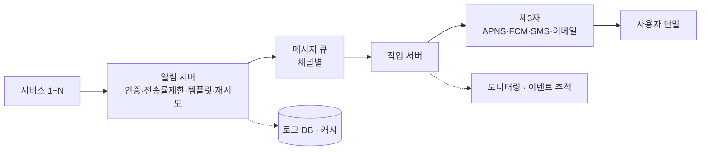

# 10장 알림 시스템 설계

> 📝 **Notion 원본**: https://app.notion.com/p/97f9e5fd0dc247cda3e77d832e48f4d2

> 🧩 **한 줄 요약** — 알림 시스템은 **서비스 → 알림 서버(인증·전송률 제한·템플릿·재시도) → 메시지 큐 → 제3자 게이트웨이(APNS/FCM/SMS/이메일) → 단말** 파이프라인. 큐로 컴포넌트를 분리해 **SPOF·병목**을 없애고, **로그 DB·재시도·이벤트 ID 중복 제거**로 유실/중복을 막는다.

---

## 1. 무슨 기능인가

- 고객에게 중요한 정보(뉴스·제품 업데이트·이벤트 등)를 알림으로 전달
- 3가지 채널 : **모바일 푸시 · SMS · 이메일**

## 2. 문제 이해 — 규모와 요구사항

| 채널 | 하루 규모 |
|---|---|
| 푸시 알림 | 1천만 건 |
| SMS | 1백만 건 |
| 이메일 | 5백만 건 |

- 실시간성 : **soft real-time** 허용

| 축 | Hard real-time | Soft real-time |
|---|---|---|
| 목표 | 데드라인 반드시 준수(예측 가능성) | 평균 성능·처리량 최적화 |
| 예 | 에어백 0.05초 | 유튜브 살짝 느려도 OK |

- 지원 기종 : iOS · 안드로이드 · 랩톱/데스크톱
- 알림 제작자 : 서버·클라이언트 앱 / **알림 켜기·끄기** 기능 필요

## 3. 개략 설계 — 채널별 게이트웨이

| 채널 | 게이트웨이 | 준비물 / 비고 |
|---|---|---|
| iOS | **APNS**(애플) | 단말 토큰 + 페이로드(JSON) |
| 안드로이드 | **FCM** | APNS 대신 FCM (나머지 동일) |
| SMS | 트윌리오·넥스모 | 제3자 유료 서비스 |
| 이메일 | 센드그리드·메일침프 | 전송 성공률↑·데이터 분석 제공 |

- **연락처 수집** : 앱 설치/가입 시 API 서버가 단말 토큰·전화번호·이메일을 DB에 저장. **1 사용자 = N 단말**(모든 단말에 전송).

## 4. 전송 절차 · 문제점 → 개선

- 흐름 : 서비스 1~N → 알림 시스템 → 제3자 서비스 → 단말
- 초기(단일 서버) 설계의 문제점과 개선 :

| 문제 | 원인 | 개선 |
|---|---|---|
| **SPOF** | 서버 1대 | 서버 다중화 |
| 규모 확장성 | 모든 기능을 한 서버가 처리 | 컴포넌트 분리·개별 확장 |
| 성능 병목 | 트래픽 집중 시 과부하 | **메시지 큐**로 비동기 처리 |

- 개선 설계 컴포넌트 : 알림 서버(전송 API·검증·전송) · **캐시**(사용자·단말·템플릿) · DB · **메시지 큐**(컴포넌트 의존성 제거 → 한 제3자 장애가 다른 채널에 영향 없음)

## 5. 상세 설계 — 안정성

- **데이터 유실 방지** : 순서·지연은 OK, 유실은 금지 → 알림을 **로그 DB**에 보관 + **재시도** 메커니즘
- **중복 전송 방지** : **이벤트 ID**로 중복 판별 — 이미 본 이벤트면 버림

## 6. 추가 컴포넌트 · 고려사항

- **알림 템플릿** : 인자·스타일·추적 링크만 바꿔 일관된 알림을 찍어내는 틀
- **알림 설정** : `user_id` / `channel` / `opt_in`(채널별 수신 여부)
- **전송률 제한** : 과다 알림 → 사용자가 알림을 꺼버리는 것 방지
- **재시도** : 실패 시 재시도 전용 큐, 지속 실패 시 개발자에게 통지
- **보안** : `appKey`·`appSecret`으로 인증된 클라이언트만 API 사용
- **큐 모니터링** : 큐 적체량이 크면 작업 서버 증설 신호
- **이벤트 추적** : 데이터 분석 서비스와 통합(열람·클릭 등 추적)

## 7. 최종 설계 (파이프라인)

## 🔁 셀프 체크

1. 알림 시스템에 메시지 큐를 두는 이유는?
2. hard/soft real-time의 차이와, 알림 시스템이 soft로 충분한 이유는?
3. 알림의 유실과 중복은 각각 어떻게 막나?

답

1. 컴포넌트 간 의존성을 끊어(비동기) 성능 병목을 줄이고, 한 제3자 서비스가 장애 나도 다른 채널 알림은 정상 동작하게 하기 위해.
2. hard는 데드라인을 반드시 지켜 예측 가능성이 중요하고(에어백), soft는 평균 성능·처리량 최적화가 목표다(유튜브). 알림은 조금 지연돼도 되므로 soft로 충분하다.
3. 유실은 알림을 로그 DB에 보관하고 실패 시 재시도해 막고, 중복은 이벤트 ID로 이미 처리한 이벤트를 걸러 막는다.

---

📄 원본 노트 (정리 전 원문)

*(원문에 있던 설계 다이어그램 이미지 11개는 외부 임시 링크라 텍스트로 담을 수 없어 `[🖼️ 원본 이미지: …]` 플레이스홀더로 위치만 표시함)*

**무슨 기능인가?**
- 최신 뉴스, 제품 업데이트, 이벤트, 선물 등 고객에게 중요한 정보를 알림으로 제공
- 모바일 푸시알림, SNS 메시지, 이메일 등으로 나뉨

**문제 이해 및 설계 범위 확정**
- 종류
  - `푸시 알림` : 천만 건/하루
  - `SMS 메시지` : 백만 건/하루
  - `이메일` : 5백만 건/하루
- soft real-time 허용
  - Hard real-time : 무조건 DeadLine을 지켜야 하는 시스템
    - 빠른 거 보단 결과 예측 가능성이 중요 (에어백이 0.05초 만에 터져야하는데 0.5초만에 터지면 안되잖아)
  - soft real-time : 가끔 어겨도 괜찮은 시스템
    - 시스템 전체적인 처리량과 평균 성능을 최적화하는데 집중 (유튜브 네트워크로 인해서 조금 느려지는 거 오케이잖아?)
- 기종
  - `iOS 단말, 안드로이드 단말, 그리고 랩톱/데스크톱을 지원`
- 알림제작자
  - 서버, 클라 APP 프로그램
- 알림 켜기 끄기 기능 필요

**개략적 설계안 제시 및 동의 구하기**

*알림 유형별 지원 방안*
- iOS 푸시 알림
  `[🖼️ 원본 이미지: iOS 푸시 알림 구조도]`
  - 알림제공자
    - 알림요청 제작 후 APNS에 전달하는 역할
      - 알림 제작 시 준비물
        - 단말토큰 : 알림요청을 보내는 데 필요한 식별자
        - 페이로드 : 알림 내용 JSON
  - APNS(애플 푸시알림 서비스)
    - 푸시 알림을 iOS 단말기로 전송하는 역할
  - iOS단말
    - 푸시알림 받는 역할
- 안드로이드 푸시알림
  `[🖼️ 원본 이미지: 안드로이드 푸시 알림 구조도]`
  - iOS의 APNS 대신 FCM을 사용한다는 점이 다름(나머진 같다)
- SMS 메시지
  `[🖼️ 원본 이미지: SMS 구조도]`
  - 보통 트윌리오, 넥스모 같은 제 3 사업자의 서비스사용(유료다)
- 이메일
  `[🖼️ 원본 이미지: 이메일 구조도]`
  - 보통 상용 이메일 서비스 사용 (센드그리드, 메일침프 등)
    - 전송 성공률이 높으며, 데이터 분석 서비스도 제공해서

*연락처 정보 수집 절차*
`[🖼️ 원본 이미지: 연락처 정보 수집 절차도]`
- 알림을 보내려면 모바일 단말 토큰, 전화번호, 이메일 주소 등의 정보가 필요하다.
- 사용자가 앱을 설치하거나 처음으로 계정을 등록하면 API 서버는 해당 사용자의 정보를 수집하여 DB에 저장한다.
`[🖼️ 원본 이미지: 사용자/단말 테이블 설계도]`
- 테이블 설계안
  - 한 사용자가 여러 단말을 가질 수 있고, 알림은 모든 단말에 전송 되어야 해서

*알림 전송 및 수신 절차*
`[🖼️ 원본 이미지: 알림 전송·수신 절차(초기 설계)]`
- **1부터 N까지의 서비스** : 알림 요청하는 여러 서비스
- **알림 시스템** : 알림 전송/수신 처리의 핵심 / 서비스에 알림 전송을 위한 API 제공, 제3자 서비스에 전달할 알림 페이로드 제작
- **제3자 서비스** : 사용자에게 알림을 실제로 전달한다. 해당 서비스와 통합할 때, 확장성을 고려해야 한다.
- **iOS, 안드로이드, SMS, 이메일 단말** : 사용자는 자기 단말에서 알림을 수신

[위 설계 문제점]
- SPOF : 알림 서비스에 서버가 하나 밖에 없다는 것은, 그 서버에 장애가 생기면 전체 서비스의 장애로 이어진다.
- 규모 확장성 : 1대 서비스로 푸시 알림과 관계된 모든 것을 처리 / 중요 컴포넌트의 규모를 개별적으로 늘릴 방법이 없다. (즉, 다른 기능까지 복제해야한다)
- 성능 병목 : 모든 것을 한 서버로 처리하면 사용자 트래픽이 많이 몰리는 시간에는 시스템이 과부화 상태에 빠질 수 있다.

*개선안*
`[🖼️ 원본 이미지: 개선 설계안]`
- **1-N 서비스** : 알림 시스템 서버의 API를 통해 알림을 보낼 서비스
- **알림 서버** : 알림 전송 API, 알림 검증, DB/캐시 질의, 알림 전송 기능들을 제공한다.
- **캐시** : 사용자 정보, 단말 정보, 알림 템플릿 등을 캐시한다.
- **데이터베이스** : 사용자, 알림, 설정 등 다양한 정보를 저장한다.
- **메시지 큐** : 시스템 컴포넌트 간 의존성을 제거하기 위해 사용한다.
  - 제 3자 서비스 중 하나가 장애가 나도 다른 종류의 알림은 정상 동작

**상세 설계**

*안정성*
- 데이터 손실방지
  `[🖼️ 원본 이미지: 안정성 — 데이터 손실 방지 구조]`
  - 알림지연 순서는 괜찮지만 사라지는 건 안됨
  - 알림 시스템은 알림 데이터를 데이터베이스에 보관하고 재시도 메커니즘을 구현해야 한다.
  - 알림 로그 데이터베이스를 유지하는 것이 한 가지 방법
- 알림 중복 전송 방지
  - 알림 중복을 줄이기 위해 중복을 탐지하는 메커니즘을 도입하고, 오류를 신중하게 처리 필
  - 보내야 할 알림이 도착하면 그 이벤트 ID를 검사하여 이전에 본 적 있는 이벤트인지 살핀다. 중복된 이벤트라면 버리고, 그렇지 않으면 알림을 발송

*추가로 필요한 컴포넌트 및 고려사항*
- **알림 템플릿** : 인자나 스타일, 추적 링크를 조정하기만 하면 사전에 지정한 형식에 맞춰 알람을 만들어 내는 틀(대부분 알림 방식이 비슷하기 때문에)
- **알림 설정** : 사용자가 알림 설정을 상세히 조정할 수 있도록 한다.
  - 필요 컬럼 : user_Id / Chanel(알림이 전송될 채널, 푸시·이메일·SMS 등) / opt_in(해당 채널로 알림을 받을 것인지의 여부)
- **전송률 제한** : 한 사용자가 받을 수 있는 알림의 빈도를 제한 / 알림을 너무 많이 보내면 사용자가 알림 기능을 꺼버릴 수도 있기 때문에
- **재시도 방법** : 제3자 서비스가 알림 전송에 실패하면, 해당 알림을 재시도 전용 큐에 넣기 / 같은 문제가 지속되면 개발자에게 통지
- **푸시 알림과 보안** : 모바일 앱의 경우, 알림 전송 API는 appKey와 appSecret을 사용하여 보안을 유지 / 인증되거나 승인된 클라이언트만 해당 API를 사용하여 알림을 보낼 수 있도록
- **큐 모니터링** : 중요한 매트릭 중 하나는 큐에 쌓인 알림의 개수 / 개수가 너무 크면 작업 서버들이 이벤트를 빠르게 처리하고 있지 못하다는 뜻 / 그럴 경우에 작업 서버를 증설할 필요가 있다.
- **이벤트 추적**
  `[🖼️ 원본 이미지: 이벤트 추적 구조]`
  - 데이터 분석 서비스는 보통 이벤트 추적 기능도 제공한다.
  - 데이터 분석 서비스와도 통합해야 한다.

*최종 설계안*
`[🖼️ 원본 이미지: 최종 설계안]`
- 알림 서버에 인증과 전송률 제한 기능이 추가
- 전송 실패에 대응하기 위한 재시도 기능이 추가
- 전송 템플릿을 사용하여 알림 생성 과정을 단순화하고 알림 내용의 일관성을 유지
- 모니터링과 추적 시스템을 추가하여 시스템 상태를 확인하고 추후 시스템을 개선하기 쉽도록 함

