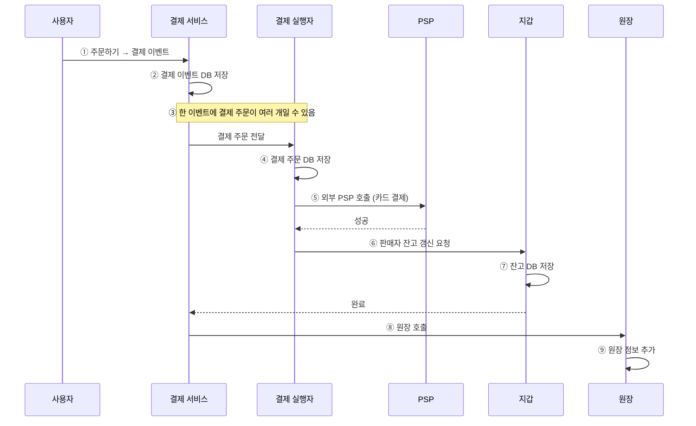
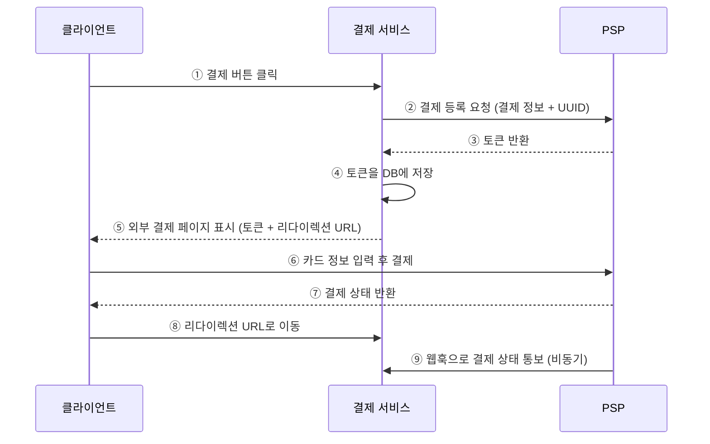
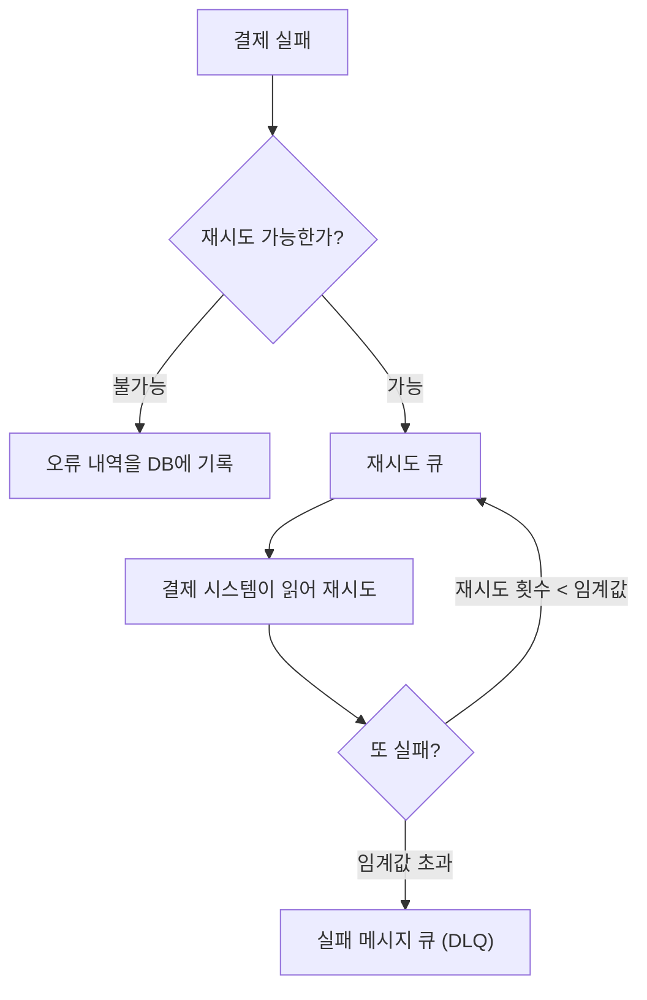

# 11장. 결제 시스템

> 📝 **Notion 원본**: https://app.notion.com/p/70beb00f254448868ed2f0222fb8a7f3

> 🧩 **한 줄 요약** — 결제 시스템은 **돈을 받아두는 흐름(pay-in)** 과 **판매자에게 내보내는 흐름(pay-out)** 두 갈래이고, 설계의 90%는 *"실패했을 때 어떻게 되는가"* 다. 그 답이 **멱등성 · 재시도 · 조정(Reconciliation) · 복식부기** 네 가지다.

---

## 목차
1. [문제 이해 및 설계 범위](#1-문제-이해-및-설계-범위)
2. [개략적 설계 — 등장인물과 pay-in 흐름](#2-개략적-설계--등장인물과-pay-in-흐름)
3. [API와 데이터 모델](#3-api와-데이터-모델)
4. [복식부기 원장](#4-복식부기-원장)
5. [PSP 연동과 외부 결제 페이지](#5-psp-연동과-외부-결제-페이지)
6. [실패에 대비하는 설계 ⭐](#6-실패에-대비하는-설계-)
7. [조정과 일관성](#7-조정reconciliation과-일관성)
8. [결제 보안](#8-결제-보안)
9. [정리 & 셀프 체크](#9-정리)

---

## 1. 문제 이해 및 설계 범위

### 1-1. 전제

- 전자상거래 앱의 **결제 백엔드**를 만든다 — 고객이 결제하면 우리 서비스가 그 돈을 관리한다.
- 신용카드만 지원하고, **카드 처리와 카드 데이터 보관은 전문 업체(PSP)** 에 맡긴다.
- 통화는 하나, 하루 **100만 건**.
- 매달 판매자에게 **대금 지급(정산)** 필수.
- 내·외부 서비스 간 **조정 작업과 불일치 교정** 필수.

### 1-2. 기능 요구사항

| 흐름 | 내용 |
|---|---|
| **pay-in** (대금 수신) | 고객이 물건을 살 때, 결제 시스템이 판매자를 대신해 돈을 **받아두는** 과정 |
| **pay-out** (대금 정산) | 모아둔 돈에서 수수료를 떼고 **판매자 통장으로 보내는** 과정 |

### 1-3. 비기능 요구사항

- **신뢰성·내결함성** — 결제 실패는 신중하게 처리해야 한다.
- **조정 프로세스** — 내부와 외부 시스템의 결제 정보가 일치하는지 **비동기로** 확인한다.

원본의 `[승조's 생각]` 6가지는 책에 없지만 직접 짚은 항목이고, 실제로 전부 이 장에서 다뤄진다.

| 내가 적은 것 | 정식 명칭 · 다뤄지는 곳 |
|---|---|
| 더블클릭 케이스, 데이터 꼬임 | **중복 제출(Double Submission)** → §6 멱등성 |
| 멱등성 키 부여 | 정확히 맞다 → §6 |
| 확장성·비동기 처리 | **메시지 큐 기반 비동기 통신** → §6 |
| 감사 추적·상태 이력 | **추가 전용(append-only) 결제 상태 테이블** → §6 |
| E2E 테스트 | 책에서 직접 다루지 않음 — 유효한 지적 |
| 즉각적인 알림 | 책 마무리의 "경보"로 미룸 |

### 1-4. 규모 추정

- **TPS = 100만 건 ÷ 10^5초 ≈ 10** — 하루는 정확히는 86,400초지만 개략 추정에선 10^5초로 잡는다.

> 📌 **10 TPS는 평균이지 피크가 아니다.** 결제는 세일·오픈 시각에 몰리는 대표적인 워크로드라, 실제 설계는 평균의 수 배~수십 배를 견디게 잡아야 한다. 면접에서도 "평균 10 TPS인데 피크는 얼마로 보나"가 바로 따라붙는 질문.

---

## 2. 개략적 설계 — 등장인물과 pay-in 흐름

### 2-1. 구성요소

| 구성요소 | 역할 |
|---|---|
| **결제 서비스** | 결제 이벤트를 받고 전체 프로세스를 조율. **위험 확인을 통과한 건만** 처리 |
| **위험 확인 서비스** | 자금세탁·테러자금 등 범죄행위 차단. 매우 전문적이라 **제3자 업체** 사용 |
| **결제 실행자** | PSP를 통해 **결제 주문 하나** 를 실행 (한 이벤트에 주문 여러 개 가능) |
| **PSP** | A계정 → B계정으로 돈을 옮김. 구매자 카드에서 인출하는 역할 |
| **카드사** | 비자, 마스터카드, 디스커버 등 |
| **원장(Ledger)** | 결제 트랜잭션의 금융 기록. 총수익 계산·수익 예측 등 **결제 후 분석** 의 근거 |
| **지갑(Wallet)** | 판매자의 계정 **잔액** 을 기록 |

> ✏️ **정정** — 원본은 결제 서비스 항목 아래에 "자금 세탁, 테러 자금 등 범죄행위 차단 목적"을 달았는데, 그건 결제 서비스가 아니라 **위험 확인(risk check) 서비스의 목적** 이다. 결제 서비스는 **조율자** 이고, 위험 판단은 외부 전문 업체에 위임한다 — 둘을 섞으면 "결제 서비스가 자금세탁을 판별한다"는 잘못된 그림이 된다.

### 2-2. 돈이 흐르는 방향

### 2-3. 결제 흐름 9단계

- ⑤에서 **PSP로 고객 돈을 빼고 나면** 결제 실행자가 성공으로 표시하고, 판매자에게 줄 돈을 **정산용으로 기록** 해둔다(실제 지급은 월말).

### 2-4. 대금 정산(pay-out) 흐름

- **타사 정산 서비스** 를 사용해 우리 은행 계좌 → 판매자 은행 계좌로 이체한다.
- 일반적으로 **외상 매입금 지급(Accounts Payable) 서비스 제공업체** 를 이용한다.

---

## 3. API와 데이터 모델

| 엔드포인트 | 역할 | 주요 필드 |
|---|---|---|
| `POST /v1/payments` | 결제 **이벤트** 실행 | 구매자 정보, 결제 주문 목록, 암호화된 카드 정보·결제 토큰, 전역 고유 ID |
| `POST /v1/payment_orders` | 결제 **주문** 등록 | 판매자 이름, 대금(string), 통화 단위, 전역 고유 ID(멱등키) |
| `GET /v1/payments/{:id}` | 단일 결제 주문의 **실행 상태** 조회 | 멱등키가 가리키는 주문의 상태 |

- **대금을 `double` 이 아니라 `string` 으로 받는 이유** — 프로토콜·S/W·H/W마다 직렬화·역직렬화에 쓰는 숫자 정밀도가 달라, 반올림 과정에서 오차가 생길 수 있다.

💰 그래서 금액을 실제로 어떻게 저장하나

- 전송은 문자열, **저장은 최소 화폐 단위의 정수** 가 정석이다. `12.34 USD` → `1234`(cent), `1500 KRW` → `1500`.
- 부동소수점을 쓰면 `0.1 + 0.2 != 0.3` 같은 오차가 그대로 **돈의 오차** 가 된다.
- 통화마다 소수 자릿수가 달라(원 0자리, 달러 2자리, 디나르 3자리) **금액과 통화 코드는 항상 붙여 다녀야** 한다.

### 3-1. 데이터베이스 선택 기준

- 테이블 : 결제 이벤트, 결제 주문
- 결제는 **ACID를 보장하는 RDB를 선호** 한다. 고를 때 따지는 것 :
  1. 안정성이 검증되었는가
  2. 모니터링·데이터 탐사 도구가 풍부한가
  3. DBA 채용 시장이 성숙했는가

---

## 4. 복식부기 원장

- 원장 시스템의 핵심 설계 원칙이 **복식부기(Double-entry bookkeeping)** 다.
- 모든 결제 거래를 **2개의 계좌에 같은 금액으로** 기록한다 — 한쪽은 차감, 다른 쪽은 입금.
- 따라서 **모든 거래 항목의 합계는 항상 0** 이다. (원본 메모대로 재무제표 B/S 느낌)

> 💡 합계가 0이라는 성질이 곧 **검증 장치** 다. 어딘가 합이 0이 아니면 그 자체로 "돈이 새거나 중복 기록됐다"는 신호가 되고, 이것이 §7 조정의 출발점이 된다.

---

## 5. PSP 연동과 외부 결제 페이지

### 5-1. 두 가지 연동 방식

- PSP와의 **직접 연결은 대형사만** 가능하다. 보통의 회사는 둘 중 하나 :
  1. 민감한 결제 정보를 안전하게 **저장할 수 있다면** → API로 PSP와 연동
  2. **저장하지 않는다면** → PSP가 제공하는 **외부 결제 페이지** 를 사용
- 핵심은 **PSP의 외부 결제 페이지가 고객 카드 정보를 직접 수집** 한다는 것. 카드 정보가 우리 서버를 아예 지나가지 않으므로 PCI DSS 부담이 크게 줄어든다.

### 5-2. 외부 결제 페이지 흐름 9단계

> ✏️ **정정** — 원본은 ③의 토큰에 "위 UUID"라고 적어 ②에서 보낸 UUID와 같은 값처럼 써두었는데, **둘은 다른 값** 이다.
> **UUID(②)** 는 우리가 만들어 보내는 값으로, 같은 주문이 두 번 등록되지 않게 하는 **중복 방지용 키** 다. **토큰(③)** 은 PSP가 그 등록 건을 자기 쪽에서 식별하려고 **발급해 돌려주는 값** 이고, ⑤에서 외부 결제 페이지가 이 토큰으로 PSP 백엔드에서 결제 요청 정보(받을 금액 등)를 조회한다.

- **⑤에 필요한 두 가지** — ④의 토큰(PSP 백엔드에서 결제 정보를 검색해 받을 금액을 알아냄), 그리고 결제 완료 후 돌아올 **리다이렉션 URL**.
- **⑨ 웹훅** — 결제 시스템이 PSP를 처음 설정할 때 등록해둔 URL. 이 이벤트를 받아 **주문 상태 필드를 최신화** 한다.

⚠️ 웹훅을 그대로 믿으면 안 되는 이유

- **중복해서 온다.** PSP는 응답을 못 받으면 재전송하므로 같은 이벤트가 여러 번 도착한다 → 웹훅 핸들러 자체가 **멱등** 해야 한다.
- **순서가 보장되지 않는다.** `성공` 뒤에 늦게 도착한 `대기중` 이 상태를 되돌릴 수 있으므로, 타임스탬프나 상태 전이 규칙으로 **역행을 막아야** 한다.
- **위조될 수 있다.** 공개된 URL이므로 PSP가 붙여 보내는 **서명을 반드시 검증** 해야 한다. 검증 없이 신뢰하면 "결제 성공" 웹훅을 아무나 쏠 수 있다.

### 5-3. 결제 지연 처리

- 결제는 내·외부 컴포넌트를 여러 개 거치므로 오래 걸릴 수 있다. 예 : **PSP가 위험한 요청으로 판단** 하거나, **카드사가 3D 보안 인증 같은 추가 확인을 요구** 하는 경우.
- 이때 PSP는 **대기(pending) 상태** 를 클라이언트에 반환하고, 우리를 대신해 진행 상황을 추적하다가 상태가 바뀌면 **웹훅으로 알린다.** (웹훅 대신 **폴링** 을 쓰기도 한다.)
- 완료 웹훅을 받으면 결제 서비스가 내부 기록을 갱신하고 고객에게 배송 완료 처리를 한다.

---

## 6. 실패에 대비하는 설계 ⭐

### 6-1. 내부 서비스 간 통신

| 방식 | 특징 |
|---|---|
| **동기식** | 대규모에서 문제 — 성능 저하, 장애 격리 곤란, 높은 결합도, 낮은 확장성 |
| **비동기 · 단일 수신자** | 공유 메시지 큐. 구독자는 여럿일 수 있지만 **처리된 메시지는 큐에서 제거** |
| **비동기 · 다중 수신자** | 소비해도 메시지가 남아 **여러 시스템이 같은 메시지를 각각** 사용 |

### 6-2. 결제 실패 처리

- **결제 상태 추적** — 상태는 **추가만 가능한(append-only) 테이블** 에 보관한다. 실패가 날 때마다 현재 상태를 보고 재시도할지 환불할지 판단할 수 있다.
- **재시도 큐와 실패 메시지 큐(DLQ)** :

### 6-3. 정확히 한 번 전달

**이중 청구는 절대 안 된다.** "정확히 한 번"은 두 조건을 모두 만족시켜 만든다.

| 조건 | 수단 |
|---|---|
| **최소 한 번** 은 실행 | 재시도 전략 |
| **최대 한 번** 만 실행 | 멱등성 |

**재시도 전략** — 즉시 재시도 / 고정 간격 / 증분 간격 / **지수적 백오프**(직전 대비 2배씩, 네트워크 문제가 지속될 때) / 취소. 에러 응답에는 `Retry-After` 같은 헤더를 붙인다.

**멱등성 동작** :
1. 결제 요청을 받고 DB 테이블에 새 레코드를 넣으려 시도한다.
2. **추가되면** 처음 보는 결제 시도다 → 실행한다.
3. **추가가 안 되면** 이미 받은 요청이다 → 실행하지 않고 기존 결과를 돌려준다.

> ✏️ **정정** — 원본에 멱등키를 "**결제 시도마다** 발급하는 키"라고 적었는데, 그러면 재시도할 때마다 새 키가 생겨 **멱등성이 정확히 깨진다.**
> 멱등키는 **주문(요청) 하나당 하나** 를 발급하고, **재시도할 때는 같은 키를 그대로 다시 보내야** 한다. 서버가 "이 키를 이미 봤다"고 판단할 수 있어야 중복 청구를 막을 수 있기 때문이다. 키가 바뀌면 서버 입장에선 완전히 새로운 결제 요청이다.

---

## 7. 조정(Reconciliation)과 일관성

- 비동기를 쓰면서 정확성을 보장하는 최종 수단이 **조정** 이다. 관련 서비스 간 상태를 **주기적으로 비교** 한다.
- 조정 시스템은 은행이나 PSP가 보내는 **정산 파일** 을 읽어 원장 시스템과 대조하고, 내부 일관성도 확인한다.

| 상황 | 처리 |
|---|---|
| 유형을 알고, 해결도 자동화 가능 | 자동화 프로그램이 교정 |
| 유형은 아는데 자동화 불가 | 작업 대기열 → 재무팀이 수동 수정 |
| 분류할 수 없는 유형 | 특별 작업 대기열 → 재무팀이 조사 |

### 7-1. 일관성

- 분산 환경에서는 서비스 간 통신 실패로 데이터 불일치가 생긴다.
- **내부 ↔ 외부** 사이는 **멱등성 + 조정** 으로 맞춘다. 조정 절차는 선택이 아니라 **필수** 다.
- **데이터 다중화** 에서 생기는 불일치는 두 방법으로 :
  1. 주 데이터베이스에서만 읽기/쓰기를 처리한다.
  2. 모든 사본이 항상 동기화되도록 한다 (합의 알고리즘, 합의 기반 분산 DB 등).

---

## 8. 결제 보안

| 문제 | 해결책 |
|---|---|
| 요청/응답 도청 | HTTPS 사용 |
| 데이터 변조 | 암호화 및 무결성 강화 모니터링 |
| 중간자 공격 | 인증서 고정(pinning)과 함께 SSL 사용 |
| 데이터 손실 | 여러 지역에 걸쳐 DB 복제 및 스냅샷 생성 |
| DDoS | 처리율 제한 및 방화벽 |
| 카드 도난 | **토큰화** — 카드번호 대신 토큰을 저장 |
| PCI 규정 준수 | PCI DSS — 브랜드 신용카드를 처리하는 조직을 위한 정보 보안 표준 |
| 사기(fraud) | 주소 확인, CVV, 사용자 행동 분석 등 |

---

## 9. 정리

| 개념 | 한 줄 정의 |
|---|---|
| pay-in / pay-out | 돈을 받아두는 흐름 / 판매자에게 내보내는 흐름 |
| 복식부기 | 한 거래를 두 계좌에 기록 — 합계는 항상 0 |
| 멱등성 | 같은 키로 여러 번 와도 **최대 한 번만** 실행 |
| 재시도 + 멱등성 | = 정확히 한 번 전달 |
| 조정 | 내·외부 상태를 주기적으로 대조해 불일치 교정 |
| 외부 결제 페이지 | 카드 정보가 우리 서버를 안 지나가게 하는 장치 |

---

## 🔁 셀프 체크

1. "정확히 한 번 전달"을 만들려면 무엇과 무엇이 동시에 필요한가?
2. 네트워크 오류로 결제를 재시도한다. 멱등키는 **새로 발급** 해야 하는가?
3. 멱등성을 완벽히 구현했는데도 **조정 절차가 여전히 필요한** 이유는?

답

1. **재시도 전략(최소 한 번)** 과 **멱등성(최대 한 번)**. 둘 중 하나만으로는 누락이나 이중 청구가 생긴다.
2. **아니다. 같은 키를 그대로 다시 보내야 한다.** 키를 새로 발급하면 서버가 새 결제로 인식해 이중 청구가 난다.
3. 멱등성은 **우리가 보내는 요청** 만 통제한다. PSP·은행 쪽에서 벌어진 일, 응답이 유실돼 우리 상태만 어긋난 경우는 막지 못하므로, **양쪽 기록을 실제로 대조** 해야만 발견된다.

> 🏁 **책에서 미룬 주제** — 모니터링 주요 지표, 경보, 디버깅 도구, 환율, 지역, 현금 결제, 구글/애플 페이 연동.

---

📄 원본 노트 (정리 전 원문)

**문제 이해 및 설계 범위 확정**

- 전자상 거래 APP을 위한 결제 백앤드 구축 가정 / 즉, 고객이 특정 APP에서 결제를 하면 우리 서비스가 돈을 관리하는
- 결제는 신용카드만 + 결체처리는 전문업체 사용
  - 신용카드 데이터도 전문업체
- 통화는 하나만 사용
- 결제는 하루 100만 건
- 매달 판매자에게 대금 지급 절파 필수
- 내/외부 서비스간 조정작업 및 불일치 시 교정(필수)

**기능 요구사항**

- pay-in 흐름: 고객이 물건을 살 때, 결제 시스템이 사장님을 대신해서 돈을 받아두기
- pay-out 흐름: 결제 시스템이 앞서 모아둔 돈에서 자기들 몫을 때고 진짜 물건을 판 사장님들의 통장으로 돈을 쏴주는 과정

**비기능 요구사항**

- 신뢰성 및 내결함성: 결제 실패는 신중하게 처리가 필수
- 내부 서비스와 외부 서비스 간의 조정 프로세스: 시스템 간의 결제 정보가 일치하는지 비동기적으로 확인한다.
- [승조's 생각]
  - 데이터 정합성과 동시성 관리: 더블클릭케이스, 결제 시 데이터 꼬임이 없도록
  - 멱등성 : 요청이 재시도가 되었을 때 2번 결제가 되지 않도록 각 결제 요청마다 멱등성 키를 부여하기
  - 확장성과 고가용성을 생각하기(비동기 처리) : 확 몰렸을 때 문제를 고려
  - E2E 테스트가 잘 되어야 할거 같다 : 결제가 잘못되면 망하니까
  - 감사 추적 및 상태 이력 : PG사를 100% 믿을 수는 없으니까
  - 즉각적인 알림 : 문제시 알림 잘 해야져?

**개략적인 규모 추정**

- TPS : 10 (하루 100만 건의 트랜잭션 / 10^5초 (하루를 초로 나누면))

**개략적 설계안 제시 및 동의 구하기**

**대금 수신 흐름**

- 구매자-신용카드→(대금수신)→웹사이트 은행계좌→(대금청산)→ 판매자
- `[이미지] private-user-images.githubusercontent.com/55437339/359763726-55ddd43b-1fed-4eb5-ae3b-99f1f808bebb.png — JWT 만료로 404`

**결제 서비스**

- 결제 서비스는 사용자로부터 결제 이벤트를 수락하고 결제 프로세스를 조율
  - 자금 세탁, 테러 자금 등 범죄행위 차단 목적
- 위험 확인을 통과한 결제만 처리
- 위험 확인 서비스는 매우 복잡하고 고도로 전문화되어 있으므로 제 3자 제공업체를 이용

**결제 실행자**

- 결제 실행자는 PSP를 통해 결제 주문 하나를 실행
- 하나의 결제 이벤트에는 여러 결제 주문이 포함될 수 있음

**결제 서비스 공급자**

- PSP는 A계정에서 B계정으로 돈을 옮기는 역할을 담당한다.
  - 구매자 카드 계좌에서 돈을 인출하는 역할

**카드 유형**

- 카드사는 신용 카드 업무를 처리하는 조직이다.
- ex. 비자, 마스터카드, 디스커버리 등

**원장**

- 원장은 결제 트랜잭션에 대한 금융 기록이다.
  - 사용자가 구매시 사용자 돈이 나가고 판매자에게 그 돈이 지급되는 로그를 남기는 거
- 원장 시스템은 결제 후 분석에서 매우 중요한 역할을 함
  - 전자상거래 웹사이트의 총 수익을 계산
  - 향후 수익을 예측하는 등

**지갑**

- 지갑에는 판매자의 계정 잔액을 기록한다.

**결제 흐름**

1. 사용자가 `주문하기` 버튼을 클릭하면 결제 이벤트가 생성되어 결제 서비스로 전송된다.
2. 결제 서비스는 결제 이벤트를 데이터베이스에 저장한다.
3. 때로는 단일 결제 이벤트에 여러 결제 주문이 포함될 수 있다.
4. 결제 실행자는 결제 주문을 데이터베이스에 저장한다.
5. 결제 실행자가 외부 PSP를 호출하여 신용카드 결제를 처리한다.
   - PSP로 고객의 돈을 빼고 나서 결제실행자가 성공으로 표시하고 / 판매자에게 줄 돈을 정산해서 기록(월말 정산이니까)
6. 결제 실행자가 결제를 성공적으로 처리하면, 결제 서비스는 지갑을 갱신하여 특정 판매자의 잔고를 기록한다.
7. 지갑 서버는 갱신된 잔고 정보를 데이터베이스에 저장한다.
8. 지갑 서비스가 판매자 잔고를 성공적으로 갱신하면 결제 서비스는 원장을 호출한다.
9. 원장 서비스는 새 원장 정보를 데이터베이스에 추가한다.

**결제 서비스 API**

- POST /v1/payments (결제 이벤트 실행)
  - 하나의 주문에 여러 목록이 들어갈 수 있으니까
    - 구매자 정보(JSON)
    - 결제주문 목록(list)
    - 암호화된 신용카드 정보나 결제 토큰(JSON)
    - 결제 이벤트를 식별하는 전역적으로 고유한 id
- POST /v1/payments_orders (결제 이벤트 실행)
  - 판매자 이름
  - 대금 양(string)
    - double이 아닌 이유
      - 프로토콜, S/W,H/W 에따라 직렬/역직렬화에 사용하는 숫자 정밀도가 달라질 수 있어서 반올림 할 때 에러 날 수 있기에
  - 통화 단위
  - 주문을 식별하는 전역적으로 고유한 ID(멱등키로 쓸 컬럼)
    - 결제 시도마다 발급하는 키
- GET /v1/payments/{:id} (단일 결제 주문의 실행 상태 반환)
  - 멱등키가 가리키는 단일 결제 주문의 실행 상태를 반환

**결제 서비스 데이터 모델**

- 테이블: 결제 이벤트, 결제 주문
- 중요한 고려사항
  1. 안정성이 검증되었는가?
  2. 모니터링 및 데이터 탐사에 필요한 도구가 풍부하게 지원되는가?
  3. DBA 채용 시장이 성숙했는가? 결제는 ACID를 보장하는 RDB를 선호하기에

**복식부기 원장 시스템**

- 원장 시스템에는 복식부기라는 중요한 설계 원칙이 있다.
- 복식부기는 모든 결제 시스템에 필수 요소이며 정확한 기록을 남기는 데 핵심적 역할을 한다.
  - 모든 결제 거래를 2개의 별도 원장 계좌에 같은 금액으로 기록한다.
  - 한 계좌에서는 차감이 이루어지고 다른 계좌에는 입금이 이루어진다.
    - 모든 거래 항목의 집계는 0 (약간 장부 B/S느낌)

**외부 결제 페이지**

- 신용 카드 정보를 취급하지 않기 위해 기업들은 PSP에서 제공하는 외부 신용 카드 페이지를 사용한다.
- 중요한 건 PSP가 제공하는 외부 결제 페이지가 직접 고객 카드 정보를 수집한다라는 것

**대금 정산 흐름**

- 타사 정산 서비스를 사용하여 전자상거래 웹사이트 은행 계좌에서 판매자 은행 계좌로 돈을 이체한다.
- 일반적으로 결제 시스템은 대금 정산을 위해 외상 매입금 지급 서비스 제공업체를 이용한다.

**상세 설계**

**PSP 연동**

- 직접 연결은 큰회사만 가능 아래는 보통의 회사가 결제 연동하는 방법
1. 회사가 민감한 결제 정보를 안전하게 저장할 수 있다면 API를 통해 PSP와 연동한다.
2. 민감한 결제 정보를 저장하지 않는다면, PSP는 카드 결제 세부 정보를 수집하여 PSP에 안전하게 저장할 수 있도록 외부 결제 페이지를 제공한다.

- `[이미지] private-user-images.githubusercontent.com/55437339/359772368-4b0dd894-fb0d-4768-ab06-ab950b1277fe.png — JWT 만료로 404`

1. 사용자가 클라이언트 브라우저에서 `결제` 버튼을 클릭한다. (결제 서비스 호출)
2. 결제 주문 정보를 수신한 결제 서비스는 결제 등록 요청을 PSP로 전송한다.
   - 요청은 결제에 필요한 내용 + UUID(주문이 한 번만 등록 되도록)을 보낸다
3. PSP는 결제 서비스에 토큰을 반환한다.
   - 위 UUID
4. 결제 서비스는 PSP가 제공하는 외부 결제 페이지를 호출하기 전에 토큰을 데이터베이스에 저장한다.
5. 토큰을 저장하고 나면 클라이언트에게 PSP가 제공하는 외부 결제 페이지를 표시한다.
   - 필요한 것
     - 4단계 토큰 : 이 토큰으로 PSP의 백엔드에서 결제요청 정보 검색
       - 여기서 사용자에게 받을 금액을 알아내기
     - 리다이렉션 URL : 결제 완료 후 호출 될 URL
6. 사용자는 결제 서부 정보를 PSP의 웹 페이지에 입력한 다음 결제 버튼을 클릭한다.
7. PSP가 결제 상태를 반환한다.
8. 사용자는 리다이렉션 URL이 가리키는 웹 페이지로 보내진다.
9. 비동기적으로 PSP는 웹훅을 통해 결제 상태와 함께 결제 서비스를 호출한다.
   - 웹훅 : 결제 시스템 쪽에서 PSP를 처음 설정할 때 등록한 URL
     - 이걸로 이벤트를 다시 수신하면 결제 상태를 추출해서 주문 상태 필드를 최신화 할 수 있다

**조정**

- 비동기사용시 정확성을 보장하는 방법
- 관련 서비스 간의 상태를 주기적으로 비교하여 일치하는지 확인한다.
- 조정 시스템은 은행이나 PsP가 보내는 정산 파일의 세부 정보를 읽어 원장 시스템과 비교한다.
- 결제 시스템의 내부 일관성을 확인할 수도 있다.
  1. 어떤 유형의 문제인지 알고 있으며 문제 해결 절차를 자동화할 수 있는 경우: 자동화 프로그램 작성
  2. 어떤 유형의 문제인지는 알지만 문제 해결 절차를 자동화할 수 없는 경우: 작업 대기열에 넣고 재무팀에서 수동으로 수정
  3. 분류할 수 없는 유형의 문제인 경우: 특별 작업 대기열에 넣고 재무팀에서 조사

**결제 지연 처리**

- 결제가 많은 컴포넌트 + 내/외부를 거치니까 결제가 오래 걸릴 수 있다(아래예시)
  - PSP가 위험한 요청이라 생각하는 경우
  - 신용 카드사가 3D 보안 인증 같은 추가 보호 장치를 요구하는 경우
- 위 처럼 느릴 때 PSP는 어떻게 처리하나?
  - PSP는 결제가 대기 상태임을 알리는 상태 정보를 클라이언트에게 반환하고, 클라이언트는 이를 사용자에게 표시한다.
  - PSP가 우리 회사를 대신하여 대기 중인 결제의 진행 상황을 추적하고, 상태가 바뀌면 PSP에 등록된 웹훅을 통해 결제 서비스에 알린다.
- 결제 완료가 되면 PSP는 웹훅을 호출, 결제서비스는 내부 시스템에 기록된 정보를 업데이트 하고 고객에게 배송 완료
- 혹은 폴링을 하기도 한다

**내부 서비스 간 커뮤니케이션**

- 동기식 통신 : 대규모로 가면 문제
  - 성능 저하
  - 장애 격리 곤란
  - 높은 결합도
  - 낮은 확장성
- 비동기 통신
  - 단일 수신자: 각 요청은 하나의 수신자 또는 서비스가 처리한다. (공유 메시지 큐 활용)
    - 큐에는 복수의 구독자가 있을 수 있고
    - 처리된 메시지는 큐에서 바로 제거 된다
  - 다중 수신자: 각 요청은 여러 수신자 또는 서버가 처리한다.
    - 소비자가 메시지를 소비해도 메시지가 바로 안사라짐
      - 각각의 시스템에서 같은 메시지를 사용할 수 있다

**결제 실패 처리**

- 안정성을 위해서
- 결제 상태 추적: 결제 상태는 데이터 추가만 가능한 데이터베이스 테이블에 보관한다.
  - 실패가 일어날 때마다 결제 거래의 현재 상태를 파악하고 재시도 또는 환불 판단
- 재시도 큐 및 실패 메시지 큐
  - 재시도 큐: 일시적 오류 같은 재시도 가능 오류는 재시도 큐에 보낸다.
  - 실패 메시지 큐: 반복적으로 처리에 실패한 메시지는 실패 메시지 큐로 보낸다.(DLQ)
  - 순서
    - 재시도 확인
      - 재시도 가능 : 재시도 큐로 직행
      - 불가능 → 오류내역을 DB로
    - 결제시스템이 재시도 큐를 읽음 → 실패한 결제를 재시도
    - 다시 실패
      - 지정한 재시도 횟수가 임계값 안일 때 다시 재시도큐로
      - 아니라면 실패 메시지 큐로

**정확히 한 번 전달**

- 이중 청구는 절대 안됨
  - 아래를 사용
    - 최소 한 번은 실행
    - 최대 한 번 실행
- 재시도 전략
  - 어떤 결제가 최소 한 번은 실행되도록 보장 가능하다.
  - `즉시 재시도`: 즉시 요청을 다시 보냄
  - `고정 간격`: 재시도 전에 일정 시간 기다림
  - `증분 간격`: 재시도 전에 기다리는 시간을 특정한 양만큼 점진적으로 늘려감
  - `지수적 백오프`: 재시도 전에 기다리는 시간을 직전 재시도 대비 2배씩 늘려감
    - 네트워크 문제가 지속 될 때 사용하기
  - `취소`: 요청을 철회
  - 에러코드는 재시도-After같은 헤더를 붙이기
- 멱등성
  - 최대 한 번 실행을 보장한다. + 여러번 실행되도 결과는 한 번
  - 결제 요청의 멱등성을 보장하기 위해서 HTTP 헤더에 `<멱등 키: 값>`의 형태로 멱등 키를 추가한다.
    - 동작
      - 결제 시스템이 결제 요청을 받고 DB 테이블에 새 레코드를 넣으려 시도
      - 새로운 레코드가 DB에 추가되면 처음 결제 시도
      - 추가가 안되는 건 이미 받은 결제 요청

**일관성**

- 분산 환경에서 서비스 간 통신 실패로 데이터 불일치 발생할 수 있다
- 일관성 문제 해결 기법
- 내부 서비스와 외부 서비스 간의 데이터 일관성 유지를 위해서 일반적으로 멱등성과 조정 프로세스를 활용한다.
  - 단 조정 절차는 필수
- 데이터 다중화 중 발생하는 데이터 불일치 문제에는 2가지 해결방법이 있다.
  1. 주 데이터베이스에서만 읽기/쓰기 연산을 처리한다.
  2. 모든 사본이 항상 동기화되도록 한다. (ex. 합의 알고리즘, 합의 기반 분산 데이터베이스 등 사용)

**결제 보안**

| 문제 | 해결책 |
|---|---|
| 요청/응답 도청 | HTTPS 사용 |
| 데이터 변조 | 암호화 및 무결성 강화 모니터링 |
| 중간자 공격 | 인증서 고정과 함께 SSL 사용 |
| 데이터 손실 | 여러 지역에 걸쳐 데이터베이스 복제 및 스냅샷 생성 |
| 분산 서비스 거부 공격(DDoS) | 처리율 제한 및 방화벽 |
| 카드 도난 | 토큰화 |
| PCI 규정 준수 | PCI DSS는 브랜드 신용 카드를 처리하는 조직을 위한 정보 보안 표준이다. |
| 사기 | 주소 확인, 카드 확인번호(CVV), 사용자 행동분석 등 |

**마무리**

- 대금 수신 흐름/정산 흐름
- 재시도, 멱등성, 일관성
- 결제 오류 처리, 보안
- 나중에 언급할 것
  - 모니터링 주요지표
  - 경보
  - 디버깅 도구
  - 환율
  - 지역
  - 현금 결제
  - 구글/애플 페이 연동 등등

