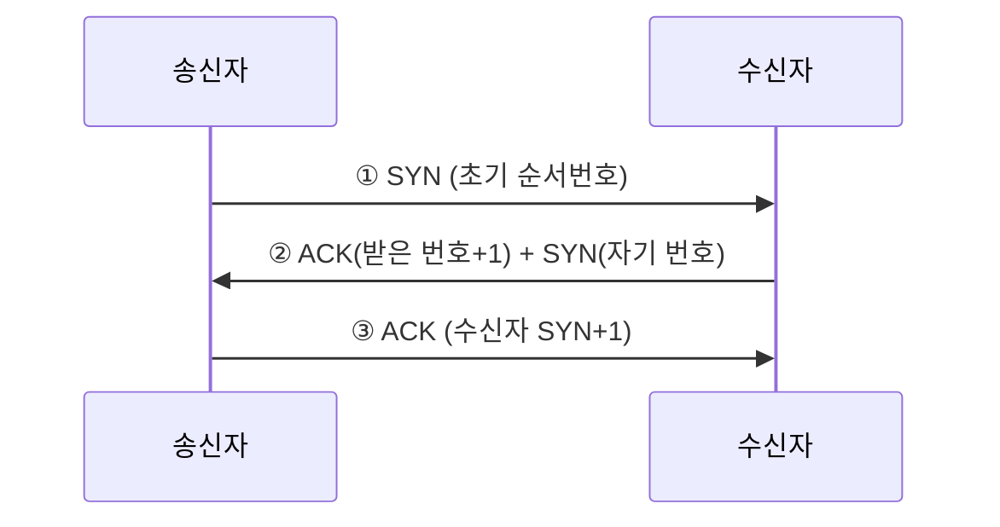

# LESSON 26. 3방향 핸드셰이크

> 📝 **Notion 원본**: https://app.notion.com/p/3c4d7d6851ff81db9f75e21399c916e1

> 🧩 **한 줄 요약** — TCP는 데이터를 주고받기 전 **3방향 핸드셰이크**(SYN → SYN+ACK → ACK)로 양쪽의 통신 준비를 확인하는 **연결형**. UDP는 그 절차 없이 **효율**을 우선하는 비연결형.

---

## 1. 연결형 vs 비연결형

| 축 | 연결형 (TCP) | 비연결형 (UDP) |
|---|---|---|
| 목적 | **정확한** 전달 | **효율적** 전달 |
| 사전 확인 | 3방향 핸드셰이크 | 없음 |

## 2. 3방향 핸드셰이크

통신 전에 양쪽이 서로 준비됐는지 확인하는 과정.

---

## 🔁 셀프 체크

1. 3방향 핸드셰이크의 세 단계는?
2. TCP와 UDP는 각각 어떤 통신에 쓰나?
3. 핸드셰이크의 ②단계에서 수신자가 SYN과 ACK를 함께 보내는 이유는?

답

1. ① 송신자 SYN → ② 수신자 SYN+ACK → ③ 송신자 ACK.
2. TCP는 정확성이 중요한 통신(연결형), UDP는 효율·속도가 중요한 통신(비연결형)에 쓴다.
3. 수신자도 통신을 시작하려면 자기 순서번호(SYN)를 동기화해야 하고, 동시에 송신자의 SYN을 받았다는 ACK도 보내야 하기 때문.

---

📄 원본 노트 (정리 전 원문)

- 전송계층 목적 : 데이터를 문제없이 전달
- 연결형 통신 : 데이터 전달을 정확하게(TCP 프로토콜 사용)
  - TCP
    - 3방향 핸드셰이크
      - TCP 통신을 하는 장치간 서로 퉁신 준비가 되었는 지 확인하는 과정
        - 송신자 : SYN(인증 숫자) 전송
        - 수신자 : 받으면 ACK(앞에서 받은 숫자 +1) + SYN(임의 번호) 전송
        - 송신자 : ACK(수신자 SYN +1) 전송
- 비 연결형 통신 : 데이터 전달을 효율적으로(UDP 프로토콜 사용)
  - UDP

