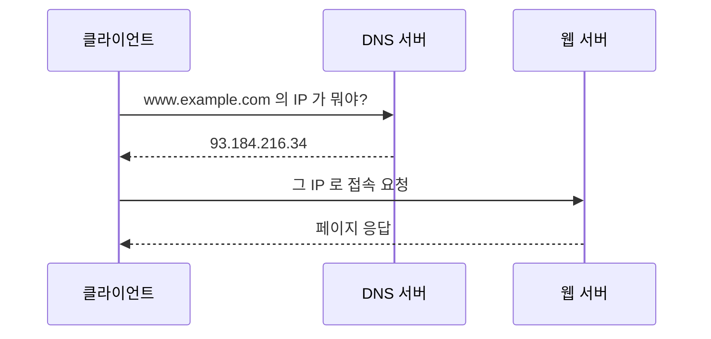

# LESSON 32. DNS 서버

> 📝 **Notion 원본**: https://app.notion.com/p/3c4d7d6851ff8190881cece8a8ac474d

> 🧩 **한 줄 요약** — DNS는 사람이 외우는 **도메인** 을 컴퓨터가 쓰는 **IP** 로 바꿔주는 전화번호부다. 핵심은 **한 대가 다 알고 있지 않다** 는 것 — 루트부터 아래로 물어 내려가며 찾고, 찾은 답은 캐시에 저장한다.

---

## 1. 기본 흐름

- 브라우저에 주소를 치면 **웹 서버에 가기 전에 DNS부터** 들른다.
- 기본 포트는 **53번**, 보통 **UDP** 를 쓴다. 질문·답이 짧아서 연결을 맺는 비용이 아까워서다.
- 응답이 크거나(512바이트 초과) 영역 전송을 할 때는 **TCP 53** 으로 넘어간다.

---

## 2. 이름을 찾아가는 순서

도메인은 **오른쪽에서 왼쪽으로** 좁혀 들어간다. `www.example.com` 이라면 :

| 단계 | 담당 | 대답하는 내용 |
|---|---|---|
| 1. 루트 `.` | 루트 네임서버 | "`com` 은 저쪽에 물어봐" |
| 2. `com` | TLD 네임서버 | "`example.com` 은 저쪽에 물어봐" |
| 3. `example.com` | **권한 있는 네임서버** | "IP는 93.184.216.34야" ← **최종 답** |

- **TLD(Top-Level Domain)** — `com`, `net`, `edu`, `kr` 같은 최상위 도메인.
- **권한 있는 네임서버(Authoritative)** — 그 도메인의 **진짜 답** 을 가진 서버. 도메인을 사면 여기 레코드를 등록하게 된다.
- 앞의 두 단계는 답을 주는 게 아니라 **"다음에 물어볼 곳"을 알려줄 뿐** 이다.

---

## 3. 누가 대신 뛰어주는가 — 재귀 질의 vs 반복 질의

원본에 적은 *"DNS 서버가 IP를 모르면 다른 DNS로 가서 받아서 클라에게 전송"* 이 부분에 정식 이름이 붙어 있다.

| 구분 | 누가 뛰는가 | 구간 |
|---|---|---|
| **재귀 질의** | DNS 서버가 **대신 다 돌아다니고** 최종 답만 준다 | 클라이언트 → 로컬 DNS |
| **반복 질의** | 물어볼 때마다 **"다음 서버 주소"만** 받아 직접 다시 묻는다 | 로컬 DNS → 루트 → TLD → 권한 |

- 클라이언트는 **한 번만 묻고 답만 받는다.** 루트부터 훑는 고생은 **로컬 DNS(리졸버)** 가 대신 한다.
- 이 대신 뛰어주는 서버를 **리졸버(Resolver)** 라 부른다. 통신사 DNS나 `8.8.8.8`(구글), `1.1.1.1`(클라우드플레어)이 그것.

---

## 4. 캐시와 TTL

- 매번 루트까지 가면 너무 느리므로, 리졸버는 한 번 찾은 답을 **캐시에 저장** 한다.
- 얼마나 오래 보관할지는 레코드에 붙은 **TTL(Time To Live, 초 단위)** 이 정한다.
- 브라우저 → OS → 리졸버 순으로 캐시를 뒤지고, 그 앞에 **`hosts` 파일** 이 있으면 DNS를 아예 묻지 않고 그 값을 쓴다.

> ⚠️ **DNS 변경은 즉시 반영되지 않는다.** 서버를 옮겨 IP를 바꿔도, 전 세계 리졸버 캐시에 **옛 IP가 TTL이 끝날 때까지 남아 있다.** 그래서 이전 작업 전에는 TTL을 미리 짧게(예 : 300초) 낮춰두고, 옮긴 뒤 되돌리는 게 정석이다. "분명 바꿨는데 왜 옛날 서버로 가지?"의 범인은 대개 이것.

---

## 5. 자주 쓰는 레코드 타입

| 타입 | 매핑 대상 |
|---|---|
| `A` | 도메인 → IPv4 주소 |
| `AAAA` | 도메인 → IPv6 주소 |
| `CNAME` | 도메인 → **다른 도메인** (별명) |
| `MX` | 도메인 → 메일 서버 (LESSON 34와 연결) |
| `NS` | 도메인 → 권한 있는 네임서버 |
| `TXT` | 임의 문자열 (소유권 인증·SPF 등에 사용) |

---

## 6. 정리

| 개념 | 한 줄 정의 |
|---|---|
| DNS | 도메인 ↔ IP를 변환하는 분산 데이터베이스 |
| 리졸버 | 클라이언트 대신 루트부터 찾아주는 서버 |
| 재귀 / 반복 질의 | 대신 다 뛰어줌 / 다음 주소만 받고 직접 감 |
| 권한 있는 네임서버 | 그 도메인의 최종 답을 가진 서버 |
| TTL | 캐시 보관 시간 — DNS 전파 지연의 원인 |

---

## 🔁 셀프 체크

1. 루트 네임서버는 `www.example.com` 의 IP를 알고 있는가?
2. 클라이언트는 루트 → TLD → 권한 순으로 직접 3번 묻는가?
3. IP를 바꿨는데 한동안 옛 서버로 접속된다. 왜인가?

답

1. **모른다.** 루트는 "`com` 을 담당하는 서버가 어디인지"만 알려준다. 최종 IP는 **권한 있는 네임서버** 만 가지고 있다.
2. **아니다.** 클라이언트는 로컬 DNS에 **한 번만** 묻는다(재귀 질의). 루트부터 훑는 반복 질의는 리졸버가 대신 수행한다.
3. **TTL이 남아 있는 캐시** 때문이다. 전 세계 리졸버가 옛 IP를 보관 중이라, TTL이 끝나야 새 값을 다시 조회한다.

---

📄 원본 노트 (정리 전 원문)

- DNS : 도메인을 IP로
  - 도메인 입력
  - 요청이 DNS
  - DNS는 요청 받은 도메인의 IP 주소를 전송
  - 사용자가 IP주소 받고 그걸로 사이트 접속
  - 웹서버는 사용자 요청에 응답
  - 만약 DNS 서버가 IP주소를 모르면 다른 DNS로 가서 IP 받고 그 IP를 받은 DNS가 클라에게 전송
- 질의 순서
  - .(루트)
  - com, edu 등등
  - 다음

