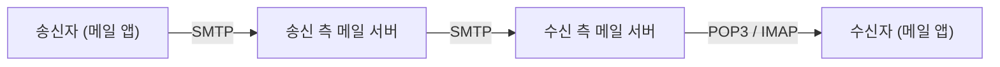

# LESSON 34. SMTP와 POP3 프로토콜

> 📝 **Notion 원본**: https://app.notion.com/p/3c4d7d6851ff81ef944cc980a7583343

> 🧩 **한 줄 요약** — 메일은 한 번에 가지 않고 **세 구간** 을 거친다. **보내는 구간은 SMTP(밀어 넣기), 받는 구간은 POP3/IMAP(꺼내 오기)** — 방향이 반대라서 프로토콜이 나뉜다.

---

## 1. 전체 흐름 — 세 구간

- **①②는 SMTP** — 편지를 우체통에 넣고, 우체국끼리 옮기는 일. 밀어내는(push) 방향.
- **③은 POP3/IMAP** — 내 사서함에서 꺼내 오는 일. 당겨오는(pull) 방향.
- 보내기와 받기가 **한 프로토콜로 안 되는 이유** 가 여기 있다. ①②는 상대가 언제 받을지 몰라도 보내지만, ③은 **내가 원할 때 내가 가지러 가야** 한다.

💬 등장인물에 이름 붙이기 — MUA / MTA / MDA

- **MUA**(Mail User Agent) — 사용자가 쓰는 메일 앱. Outlook, 지메일 웹.
- **MTA**(Mail Transfer Agent) — 서버 간 배달을 담당. 위 그림의 메일 서버.
- **MDA**(Mail Delivery Agent) — 도착한 메일을 수신자 사서함에 넣는 역할.

---

## 2. 구간 ① 송신자 → 내 메일 서버 (SMTP)

원본에 적은 대화가 실제 SMTP 명령어와 정확히 일대일로 대응한다.

| 내가 적은 말 | 실제 명령어 | 서버 응답 |
|---|---|---|
| "25 포트로 통신할거야" | TCP 연결 수립 | `220 Ready` |
| "내 이름은 컴퓨터 A" | `HELO` / `EHLO` | `250 OK` |
| "내 이메일 주소" | `MAIL FROM:` | `250 OK` |
| "수신자 이메일 주소" | `RCPT TO:` | `250 OK` |
| "이메일 본문" | `DATA` → 본문 → `.` | `250 OK` |
| "연결 종료할거야" | `QUIT` | `221 Bye` |

- 명령 하나에 응답 하나가 오가는 **주고받기(요청-응답) 구조** 다. 원본의 "서버 : OK"가 전부 `250 OK`.
- **`EHLO` 는 `HELO` 의 확장판** 이다. 서버가 지원하는 기능(인증, 암호화 등) 목록을 함께 받아온다. 요즘은 사실상 `EHLO` 만 쓴다.

---

## 3. 구간 ② 메일 서버 → 메일 서버 (SMTP)

- 송신 서버는 수신자 주소의 **도메인 부분으로 DNS에 `MX` 레코드를 조회** 해 상대 메일 서버를 찾는다. → LESSON 32와 이어지는 지점.
- 찾은 서버에 다시 SMTP로 접속해 **①과 같은 명령어 절차** 를 반복한다.
- 수신 측 서버는 받은 메일을 **수신자의 사서함에 넣어두고** 거기서 멈춘다. 수신자에게 밀어주지 않는다 — 가지러 오는 건 다음 구간의 일.

---

## 4. 구간 ③ 메일 서버 → 수신자 (POP3)

| 내가 적은 말 | 실제 명령어 |
|---|---|
| "110 포트로 통신할거야" | TCP 연결 수립 |
| "내 이름은 컴퓨터 B" | `USER` |
| "내 비밀번호는 이거" | `PASS` |
| "이메일 목록 확인" | `LIST` |
| "이메일 내려받기" | `RETR` |
| "연결 종료" | `QUIT` |

### 4-1. POP3 vs IMAP

원본에 적어둔 대로 POP3는 **가져오면 서버에서 지운다.** 그 차이를 정리하면 :

| 기준 | POP3 | IMAP |
|---|---|---|
| 서버에 원본 | 내려받고 **삭제** | **보관** |
| 여러 기기 | 먼저 받은 기기에만 남음 | 전 기기 **동기화** |
| 읽음·폴더 상태 | 기기마다 따로 놂 | 서버가 관리 → 공유됨 |
| 적합한 상황 | 기기 1대, 서버 용량 절약 | 폰·PC 동시 사용 (요즘 기본) |

---

## 5. 포트 — 교과서 번호와 실제 번호

| 용도 | 평문 | 암호화 (실제로 쓰는 것) |
|---|---|---|
| 메일 발신 (앱 → 서버) | 25 | **587** (STARTTLS) / 465 |
| 메일 중계 (서버 ↔ 서버) | 25 | 25 (그대로) |
| POP3 수신 | 110 | 995 |
| IMAP 수신 | 143 | 993 |

> ⚠️ **25번 포트로는 메일이 안 나갈 가능성이 높다.** 스팸 발송을 막으려고 대부분의 ISP와 클라우드(AWS 등)가 25번 아웃바운드를 **기본 차단** 하기 때문이다.
> 그래서 오늘날 **25번은 서버끼리의 중계 전용** 이고, 앱이 자기 서버로 메일을 보낼 때는 인증을 거치는 **587번(제출 포트)** 을 쓴다. 메일 발송이 조용히 실패한다면 가장 먼저 의심할 곳.

📮 보낸 메일이 스팸함으로 가는 이유 — SPF · DKIM · DMARC

SMTP에는 **발신자를 검증하는 장치가 원래 없다.** `MAIL FROM` 에 아무 주소나 적을 수 있어 사칭이 쉽다. 이를 DNS `TXT` 레코드로 보완한 것이 아래 셋이다.

- **SPF** — "이 도메인의 메일은 이 IP들에서만 나간다"고 선언.
- **DKIM** — 메일에 전자서명을 붙여 위·변조를 검증.
- **DMARC** — SPF·DKIM에 실패한 메일을 어떻게 처리할지(무시/격리/거부) 지정.

셋 다 없으면 정상 메일도 스팸으로 분류되기 쉽다.

---

## 6. 정리

| 개념 | 한 줄 정의 |
|---|---|
| SMTP | 메일을 **밀어 보내는** 프로토콜 (구간 ①②) |
| POP3 / IMAP | 사서함에서 **꺼내 오는** 프로토콜 (구간 ③) |
| MX 레코드 | 도메인의 메일 서버를 알려주는 DNS 레코드 |
| 587 포트 | 인증을 거치는 메일 제출 포트 (25 대신) |

---

## 🔁 셀프 체크

1. 보내기와 받기에 다른 프로토콜을 쓰는 이유는?
2. 폰에서 읽은 메일이 PC에서는 안 읽음으로 남아 있다. 무엇을 쓰고 있는가?
3. 25번 포트로 메일 발송을 구현했더니 아무 반응이 없다. 왜인가?

답

1. **방향이 반대** 이기 때문. 보내기는 상대 사서함에 **밀어 넣는(push)** 일이고, 받기는 내 사서함에서 **꺼내 오는(pull)** 일이다.
2. **POP3.** 기기마다 따로 내려받아 읽음 상태가 공유되지 않는다. 동기화하려면 **IMAP** 으로 바꿔야 한다.
3. 스팸 방지를 위해 **ISP·클라우드가 25번 아웃바운드를 차단** 하고 있을 가능성이 크다. 인증을 거치는 **587번** 을 쓰면 된다.

---

📄 원본 노트 (정리 전 원문)

- 이메일 주고 받을 때 사용하는 프로토콜
  - SMTP : 송신자가 사용하는 프로토콜
  - POP3 : 수신자가 사용하는 프로토콜
  - 순서
    - 송신자 →(SMTP)→송신자 메일서버→(SMTP)→수신자 메일서버→(POP3)→수신자
      - 송신자 → 메일서버(SMTP)
        - 컴퓨터 → 서버 : 25 포트로 통신 할거야
          - 서버 : OK
        - 컴퓨터 → 서버 : 내이름은 컴퓨터 A
          - 서버 : OK
        - 컴퓨터 → 서버 : 내 이메일 주소
          - 서버 : OK
        - 컴퓨터 → 서버 : 수신자 이메일 주소
          - 서버 : OK
        - 컴퓨터 → 서버 : 이메일 본문
          - 서버 : OK
        - 컴퓨터 → 서버 : 연결 종료 할거야
          - 서버 : OK
      - 메일서버(송신자) → 메일서버(수신자)(SMTP)
        - 송신자 → 수신자 : 이메일 전달
        - 수신자 → 송신자 : 수신자 측 메일 서버는 사용자A가 보낸 이메일을 사용자 B 이메일 함에 넣어둠
      - 메일서버 → 수신자
        - 컴퓨터 → 서버 : 110 포트로 통신 할거야
          - 서버 : OK
        - 컴퓨터 → 서버 : 내이름은 컴퓨터 B
          - 서버 : OK
        - 컴퓨터 → 서버 : 내 비밀번호는 이거
          - 서버 : OK
        - 컴퓨터 → 서버 : 이메일 목록 확인
          - 서버 : OK
        - 컴퓨터 → 서버 : 이메일 내려받기
          - 서버 : OK
        - 컴퓨터 → 서버 : 연결 종료
          - 서버 : OK
        - POP3은 수신자가 이메일을 가져오면 서버에서 이메일을 삭제하는데 만약 원하지 않는다면 IMAP을 사용하면 된다

