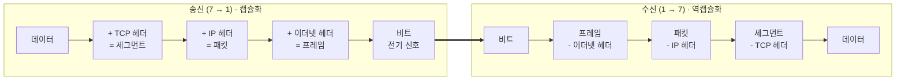

# LESSON 36. 웹 사이트에 접속하기 위한 네트워크 흐름

> 📝 **Notion 원본**: https://app.notion.com/p/3c4d7d6851ff81eb9f74cbc8c4ae6e38

> 🧩 **한 줄 요약** — 이 장은 새 개념이 아니라 **1~7계층을 실제 통신 한 번에 꿰어 보는 복습**이다. 핵심은 **보낼 때 헤더를 붙이며 내려가고(캡슐화), 받을 때 벗기며 올라간다(역캡슐화)** 는 것.

---

## 1. OSI 7계층 한눈에

| 계층 | 이름 | 한 줄 역할 | 전송 단위(PDU) | 주소·장비 |
|---|---|---|---|---|
| 7 | 응용 | 앱이 쓰는 프로토콜 (HTTP·DNS) | 데이터 | — |
| 6 | 표현 | 인코딩·암호화·압축 | 데이터 | — |
| 5 | 세션 | 연결의 수립·유지·종료 | 데이터 | — |
| 4 | 전송 | 데이터를 목적지 **프로그램** 까지 전달 | 세그먼트 | **포트** / L4 스위치 |
| 3 | 네트워크 | 다른 네트워크로 가는 **경로 설정** | 패킷 | **IP** / 라우터 |
| 2 | 데이터 링크 | 같은 네트워크 안에서 전달 | 프레임 | **MAC** / 스위치 |
| 1 | 물리 | 데이터를 전기 신호로 변환·전송 | 비트 | 케이블·리피터·허브 |

- 원본 메모대로 **7·6·5는 실무에서 "앱이 데이터를 주고받는 구간"** 으로 묶어서 봐도 무방 (TCP/IP 4계층이 실제로 이 셋을 응용 계층 하나로 통합)

## 2. LAN과 WAN

- **LAN** : 한 건물·한 사무실 같은 **좁은 범위** → **스위치**, **MAC 주소** 로 통신
- **WAN** : 다른 네트워크로 넘어가는 **넓은 범위** → **라우터**, **IP 주소** 로 경로 결정
- 왜 주소가 두 개인가
  - MAC : "**같은 네트워크 안** 에서 바로 옆 장비"를 지정 — 전 세계에서 유일하지만 **경로 정보가 없음**
  - IP : "**어느 네트워크** 의 누구"를 지정 — 계층 구조라 **경로를 찾을 수 있음**
  - → IP로 방향을 정하고, 그 구간을 실제로 건너가는 데는 MAC이 쓰인다

## 3. 송신과 수신 — 캡슐화 / 역캡슐화

- **캡슐화** : 위에서 아래로 내려가며 각 계층이 **자기 헤더를 앞에 덧붙임**
- **역캡슐화** : 아래에서 위로 올라가며 **자기 헤더를 확인하고 떼어냄**
- 핵심 : 각 계층은 **자기 헤더만 보고 자기 일만** 한다 → 계층을 나눈 이유가 여기서 드러남

---

## 4. 정리

| 개념 | 한 줄 정의 |
|---|---|
| 캡슐화 | 송신 시 계층마다 헤더를 붙이는 것 (7→1) |
| 역캡슐화 | 수신 시 계층마다 헤더를 떼는 것 (1→7) |
| PDU | 계층별 전송 단위 — 세그먼트·패킷·프레임·비트 |
| LAN / WAN | 스위치·MAC / 라우터·IP |

---

## 🔁 셀프 체크

1. 데이터가 4·3·2계층을 지나며 각각 무슨 이름으로 바뀌는가?
2. IP 주소가 있는데 MAC 주소가 왜 또 필요한가?
3. 캡슐화를 한 줄로 설명하면?

답

1. 4계층에서 TCP 헤더가 붙어 **세그먼트**, 3계층에서 IP 헤더가 붙어 **패킷**, 2계층에서 이더넷 헤더가 붙어 **프레임** 이 된다.
2. IP는 **어느 네트워크의 누구인지** 를 알려줘 경로를 찾게 해주지만, 그 경로의 **한 구간을 실제로 건너갈 때** 는 바로 옆 장비를 지정하는 MAC이 필요하다.
3. 송신할 때 **계층마다 자기 헤더를 덧붙이며 내려가는 것**. 받는 쪽은 반대로 떼며 올라간다.

---

📄 원본 노트 (정리 전 원문)

-

| 계층 | 이름 | 한 줄 역할 |
|---|---|---|
| 7 | 응용 | APP을 이용한 데이터 송수신 |
| 6 | 표현 | APP을 이용한 데이터 송수신 |
| 5 | 세션 | APP을 이용한 데이터 송수신 |
| 4 | 전송 | 데이터를 목적지에 전달 |
| 3 | 네트워크 | WAN에서 다른 네트워크로 데이터를 전달하기위한 경로 설정 |
| 2 | 데이터링크 | LAN에서 데이터 송수신 |
| 1 | 물리 | 데이터를 전기 신호로 변환·전송 |

- LAN : 스위치, MAC
- WAN : 라우터, IP 주소
- 송 : 7→1 + 캡슐화
- 수 : 1→7 + 역캡슐화

