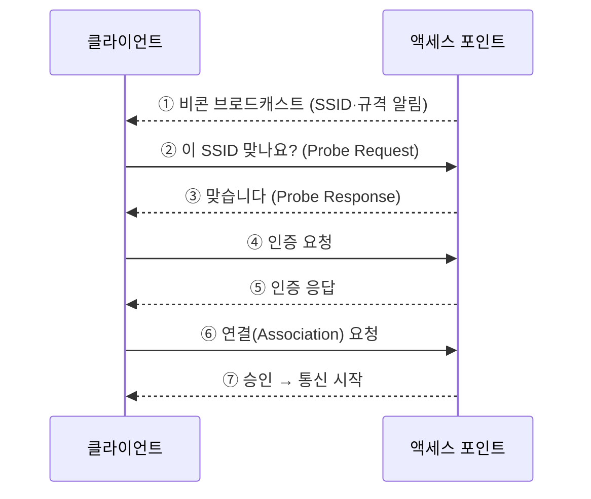

# LESSON 41. 무선 랜의 통신 방법

> 📝 **Notion 원본**: https://app.notion.com/p/3c4d7d6851ff81c19f35ee742f6a8477

> 🧩 **한 줄 요약** — 무선 접속은 **SSID로 찾고 → 인증하고 → 연결** 하는 3단계다. 그리고 연결된 뒤에도 모두가 같은 공기를 쓰기 때문에, **말하기 전에 먼저 듣는 규칙(CSMA/CA)** 이 필요하다.

---

## 1. SSID — 무선 랜의 이름표

- **SSID** : 무선 랜을 구분하는 **식별자** (이름). 최대 32자
  - 접속하려면 AP와 클라이언트의 **SSID가 동일해야 함**
  - 공유기 목록에 뜨는 "우리집Wi-Fi" 같은 이름이 그것
- AP는 기본적으로 자기 SSID를 갖고 있고, 클라이언트는 그것을 **검색해서** 연결한다

## 2. 연결 절차

- **비콘(Beacon)** : AP가 **자기 존재와 SSID·지원 규격을 알리는 주기적 신호**
  - 이게 있어서 클라이언트가 **주변 Wi-Fi 목록** 을 볼 수 있음
- 스캐닝 방식 2가지
  - **수동 스캐닝** : AP의 비콘을 **가만히 듣고** 목록을 만듦
  - **능동 스캐닝** : 클라이언트가 먼저 `Probe Request` 를 뿌리고 AP가 답함 → 더 빠름
- 인증 → 연결(Association) 승인까지 끝나야 실제 데이터 통신 시작

> ✏️ **정정** — 원본에 "무선 액세스 포인트가 클라이언트에게 비콘 메시지를 **폴링**"이라고 적었는데, 방향과 방식이 다르다.
> - **폴링** 은 "특정 상대를 하나씩 지목해 물어보는" 방식이다. 비콘은 그게 아니라 **상대를 지정하지 않고 주기적으로 뿌리는 브로드캐스트** 다 (보통 100ms마다).
> - 즉 AP는 **누가 듣든 말든 계속 방송** 하고, 클라이언트가 그걸 **주워듣는** 구조다. 그래서 아직 접속하지 않은 기기도 목록을 볼 수 있다.

## 3. 연결된 뒤 — 어떻게 순서를 정하나 (CSMA/CA)

- 문제 : 무선은 **모두가 같은 공기를 공유** 한다. 둘이 동시에 말하면 신호가 섞여 둘 다 실패
- 유선은 부딪히면 **감지** 해서 재전송하면 되지만(CSMA/CD), 무선은 **자기 송신 신호가 커서 충돌을 들을 수 없음**
- 그래서 무선은 **충돌 회피(CSMA/CA)** 를 쓴다 — 부딪히고 나서가 아니라 **부딪히기 전에 피한다**
  1. 보내기 전에 **먼저 듣는다** (다른 신호가 있나)
  2. 조용하면 **랜덤한 시간만큼 더 기다린 뒤** 전송 (동시에 튀어나가는 것 방지)
  3. 받은 쪽이 **ACK로 응답** → ACK가 안 오면 실패로 보고 재전송
- 결과 : 기다리는 시간과 ACK 때문에 **실효 속도가 이론치보다 크게 낮아짐**

⚠️ 히든 노드 문제 — 듣고 보내도 부딪히는 경우

- A와 C가 **서로의 신호는 못 듣지만** 둘 다 가운데 AP와는 통신 가능한 위치에 있을 수 있다.
- 이러면 A가 "조용하네" 하고 보내고 C도 동시에 보내서 **AP에서 충돌** 한다. 먼저 듣는 규칙이 무력화되는 상황.
- 해결 : **RTS/CTS** — 보내기 전에 AP에 "보내도 되나요(RTS)" 물어보고, AP가 "보내세요(CTS)"를 **모두에게 방송** 해 다른 기기를 잠시 침묵시킨다.

## 4. 거리와 간섭

- 거리가 멀면 신호가 약해져 **속도가 떨어짐** → AP를 **여러 대** 설치하는 것이 좋음
- 다만 AP가 너무 많으면 서로 **간섭** 이 발생

> ✏️ **정정** — 원본에 "규격이 다른 것은 서로 간섭을 안 한다"고 적었는데, 간섭 여부를 가르는 것은 **규격이 아니라 주파수 채널** 이다.
> - 802.11g와 802.11n은 규격이 다르지만 **둘 다 2.4GHz를 쓰면 간섭한다.**
> - 반대로 같은 802.11n이어도 **한쪽은 2.4GHz, 한쪽은 5GHz면 간섭하지 않는다.**
> - 정확히는 : **주파수 대역이 다르거나, 같은 대역 안에서도 채널이 겹치지 않으면** 간섭하지 않는다.
> - 실무 : 2.4GHz는 채널이 서로 겹쳐서 **1·6·11번만 완전히 비중첩** → 인접 AP끼리 이 셋을 번갈아 배정한다.

🔐 보안 — 전파는 벽을 넘어간다

- 무선은 건물 밖에서도 신호를 잡을 수 있으므로 **암호화가 필수**
- **WEP** : 초기 방식, 취약점이 많아 **현재는 사용 금지 수준**
- **WPA2** : 오랫동안 표준. AES 기반
- **WPA3** : 최신. 비밀번호 추측 공격에 강하고 개방형 네트워크도 암호화
- 참고 : **SSID 숨김은 보안 수단이 아니다.** 접속 중인 기기의 통신을 관찰하면 SSID가 드러나므로, 불편만 늘고 방어 효과는 거의 없다.

---

## 5. 정리

| 개념 | 한 줄 정의 |
|---|---|
| SSID | 무선 랜을 구분하는 이름. 양쪽이 같아야 접속 |
| 비콘 | AP가 주기적으로 **브로드캐스트** 하는 존재 알림 신호 |
| 연결 절차 | 스캐닝 → 인증 → 연결(Association) |
| CSMA/CA | 먼저 듣고, 랜덤 대기 후 전송, ACK로 확인 — **충돌 회피** |
| 간섭 기준 | 규격이 아니라 **주파수 채널** 이 겹치는지 여부 |

---

## 🔁 셀프 체크

1. 접속하지 않은 상태에서도 주변 Wi-Fi 목록이 보이는 이유는?
2. 무선은 왜 충돌을 감지(CD)하지 않고 회피(CA)하는가?
3. 802.11g 공유기와 802.11n 공유기를 나란히 두면 간섭하는가?

답

1. AP가 **비콘을 주기적으로 브로드캐스트** 하기 때문이다. 특정 기기를 지목해 보내는 게 아니라 누가 듣든 계속 뿌리므로, 아직 접속하지 않은 기기도 목록을 만들 수 있다.
2. 무선은 **자기가 송신 중인 신호가 너무 커서** 동시에 오는 남의 신호를 들을 수 없어 충돌을 감지할 수 없다. 그래서 먼저 듣고 랜덤 대기하는 방식으로 **미리 피한다.**
3. **주파수 채널이 겹치면 간섭한다.** 규격이 달라도 둘 다 2.4GHz의 같은 채널을 쓰면 간섭하고, 하나가 5GHz면 간섭하지 않는다.

> 🏁 **모두의 네트워크 완독.** 1~7장에서 계층을 하나씩 쌓고, 8장에서 그것을 한 번의 통신으로 꿰었고, 9장에서 그 통신을 케이블 없이 하는 법을 봤다.

---

📄 원본 노트 (정리 전 원문)

- SSID : 무선 랜을 구분하는 식별자
  - 특정 무선 랜에 접속하려는 무선 액세는 포인트나 클라는 반드시 SSID가 동일해야함
  - 연결 방식
    - 액세스 포인트는 SSID를 기본적으로 가지고 있고
    - 클라는 SSID를 검색해서 해당 네트워크에 연결한다
    - 무선 액세스 포인트가 클라에게 비콘 메시지를 폴링
      - 비콘 : 가까운 기기에게 정보를 전달하는 무선 통신
      - 비콘이 있어서 주변 랜 네트워크의 SSID를 찾을 수 있는 거임
    - 클라가 신호를 받으면 자신의 SSID와 같은지 무선 액세스 포인트에 문의
    - 같은 SSID 무선 액세스 포인트가 응답
    - 인증을 거치고 클라가 무선 액세스 포인트에 연결 요청
    - 무선 액세스 포인트로 부터 승인을 받으면 통신
  - 거리가 멀면 문제가 생김, 가까우면 빠른데
  - 그래서 액세스 포인트를 여러대 설치하는 게 좋다
    - 근데 너무 많으면 간섭이 발생
    - 그때 규격이 다른 거는 서로 간섭을 안함

